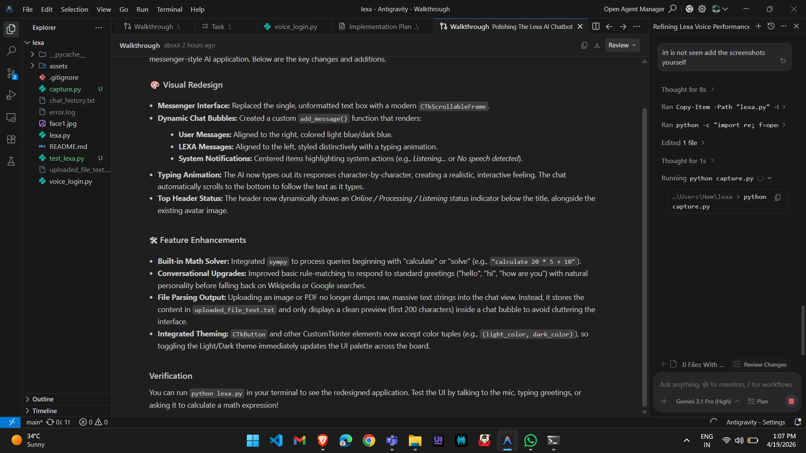
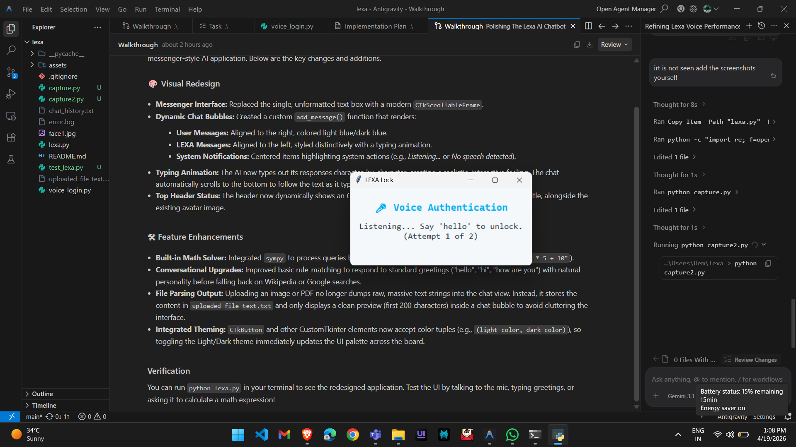

# LEXA AI OS

LEXA is a premium, autonomous AI operating system and virtual assistant built in Python.

## Features
- **Voice Authentication**: Secure voice-based login.
- **Intent Detection**: Local execution for fast commands (opening apps, system controls, math).
- **LLM Integration**: Conversational fallback to Large Language Models for complex queries.
- **Modern UI**: Sleek, dark-mode user interface using CustomTkinter.
- **Data Parsing**: Extract text from images and PDF files locally.

## Screenshots
*(Add your screenshots here by replacing the placeholder links!)*

 

## Requirements
`pip install pyttsx3 speechrecognition customtkinter Pillow pytesseract PyMuPDF sympy psutil requests`

## Usage
Run `python lexa.py` to start the assistant.
